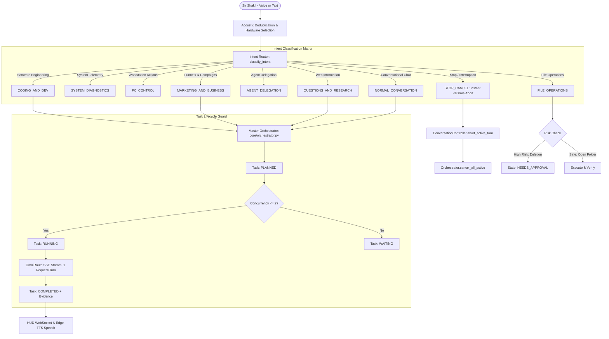

# J.A.R.V.I.S. INTELLIGENCE & ORCHESTRATION ARCHITECTURE

**System**: J.A.R.V.I.S. Desktop AI Operating System  
**Principal User**: Sir Shakil Ahmed Chowdhury  
**Platform**: Windows 11, Python 3.14.7 64-bit, FastAPI, WebSockets  
**Architecture Version**: Phase 1 & 2 Modular AI Operating System  

---

## 1. System Overview & Core Philosophy

The upgraded J.A.R.V.I.S. operates on three fundamental engineering principles:
1. **Deterministic Intent Routing**: Every user utterance is parsed into one of 9 discrete intents with confidence scoring and ambiguity detection. No random regex interception or canned status monologues.
2. **Master Orchestrator with Bounded Concurrency**: Tasks are structured into sequential verifiable steps with a strict concurrency ceiling (maximum 2 concurrent subtasks). Subtasks inherit cancellation signals from the conversation controller.
3. **Verified Evidence of Execution**: Tools and agents cannot transition to `COMPLETED` based merely on process spawning. Every action returns structured evidence, execution telemetry, and verified output.

---

## 2. Architectural Blueprint

---

## 3. The 9 Core Intents

| Intent | Scope | Target Specialist | Verification Method |
| :--- | :--- | :--- | :--- |
| `STOP_CANCEL` | Instant interruption ("stop", "cancel", "be quiet", "wait") | Core Controller | State returns to `IDLE` in < 100ms |
| `SYSTEM_DIAGNOSTICS` | CPU, RAM, GPU, storage, process loads | `pc_controller` | Real-time psutil hardware telemetry |
| `PC_CONTROL` | Volume, media keys, lock screen, app launch | `pc_controller` | Process ID verification & pycaw levels |
| `FILE_OPERATIONS` | File creation, directory views, deletions | `file_controller` | Path existence check & approval gate |
| `AGENT_DELEGATION` | Explicit delegation to on-demand specialists | Specialist Registry | Agent execution proof & return packet |
| `CODING_AND_DEV` | Python, JavaScript, HTML/CSS, FastAPI, scripts | `coding_agent` | Code syntax compile & desktop file save |
| `MARKETING_AND_BUSINESS` | Offers, VSLs, ads, copy, campaigns | `marketing_agent` | Structured JSON campaign artifacts |
| `QUESTIONS_AND_RESEARCH` | Web searches, fact checking, online data | `research_agent` | Live browser / search result extraction |
| `NORMAL_CONVERSATION` | Greetings, executive banter, basic answers | `core_brain` | Direct 1–2 sentence spoken response |

---

## 4. Ambiguity Detection & Clarification Protocol

When user prompts lack critical parameters (e.g. bare directives like `"open"`, `"run"`, `"start"`, `"do it"`), the system does **not** guess or execute arbitrary binaries:
* `is_ambiguous` is set to `True`.
* Confidence score is downgraded ($< 0.50$).
* A single, polite clarification question is returned:  
  * *"Which application would you like me to open, Sir Shakil?"*  
  * *"Could you please specify which task or application you would like me to execute, Sir Shakil?"*

---

## 5. Master Orchestrator Specification (`core/orchestrator.py`)

* **Task State Machine**:  
  `PLANNED` $\to$ `RUNNING` $\to$ `WAITING` $\to$ `NEEDS_APPROVAL` $\to$ `COMPLETED` / `FAILED` / `CANCELLED`
* **Concurrency Guard**: Maximum 2 concurrent active subtasks enforced via `asyncio.Semaphore(2)`.
* **Bounded History**: Task registry history capped at 50 records to ensure zero memory leaks over long sessions.
* **Telemetry Diagnostics**: Exposes active tasks, queue depth, runtimes, and completion rates via `/api/orchestrator/status` and `/ws/telemetry`.
